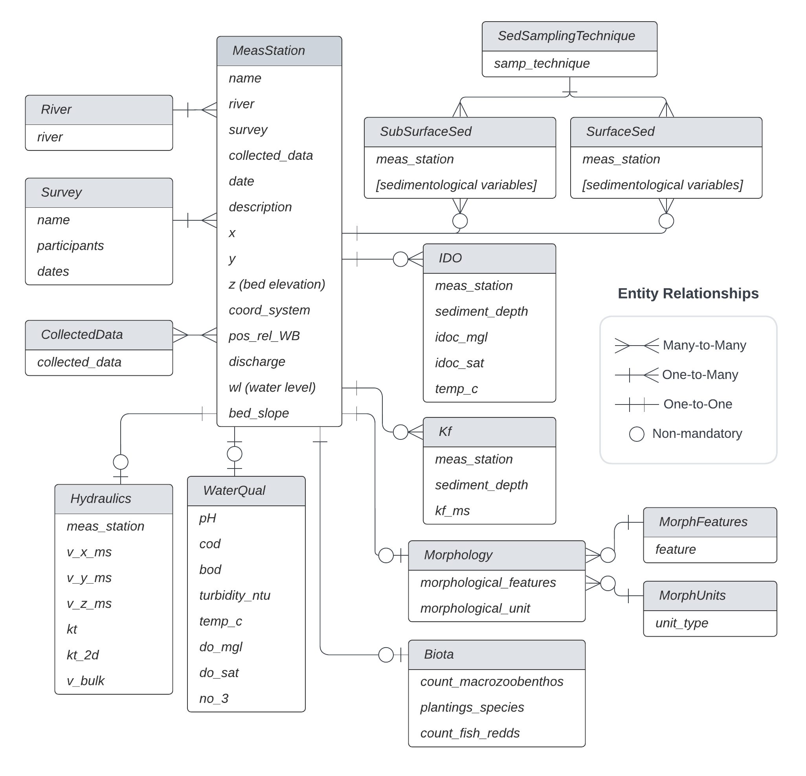

# River Analyst User Manual
River Analyst is a database application framework built with the [Django](https://www.djangoproject.com/) web application framework (Python) to leverage fast river ecosystem analyses. 

# Installation
### Linux
- Clone this repository: 
    ```console 
    git clone https://github.com/beatriznegreiros/river-analyst.git
    ```
- Make sure to have pip3 and [virtualenv](https://pypi.org/project/virtualenv/) installed by: 
    ```console
    sudo apt update
    sudo apt install python3-pip
    pip3 install virtualenv
    ```
- Create new virtual environment:
    ```console
    python3.9 -m venv /path/to/new/virtual/environment
    ```
- Activate new virtual environment:
    ```console
    source /path/to/new/virtual/environment/bin/activate
    ```
- Install dependencies:
    ```console
    pip3 install -r requirements.txt
    ```
  
### Windows
- Clone this repository: 
    ```console
    git clone https://github.com/beatriznegreiros/river-analyst.git
    ```
- Make sure to have [Anaconda](https://docs.anaconda.com/anaconda/install/index.html) installed.
- Create conda environment: 
    ```console
    conda create --name [env_name] python=3.9
    ```
- Activate conda environment:
    ```console
    conda activate [env_name]
    ```
- Install dependencies:
    ```console
    pip3 install -r requirements.txt 
    ```

    
# Usage
## Database architecture




## Running the app
- Go to repository directory
    ``cd path/to/river-analyst``
- Make migrations (optional)
    ``python3 manage.py migrate``
Obs.: Migrations are in principle python commands wrapped around SQL passed from the Django framework to the sql database.
- Run the server locally
    ``python3 manage.py runserver``
- Create superuser for having full admin rights over the app:
    ``python3 manage.py createsuperuser``
  
# Initializing a new database with template CSVs
- Add data to the csv templates under the path ``riveranalyst/river-analyst/media/``
- ``cd`` to the ``riveranalyst/utils`` directory
    ``cd riveranalyst/utils``
- Execute scripts to initialize targeted data models
    - It is important to begin with populating the **MeasStation** model, which is where all data models connect:
        - Here, it is crucial that the field ``meas_station`` is unique and contains no typos. This field will be used to generate foreign keys to link data models.
    ``python fill_stations_tab.py``
    - Then, any data model can be populated afterwards, for instance:
        - the field ``meas_station`` needs to match the names given in the MeasStation data model.
            - ``python fill_surf_tab.py`` for filling the **SurfaceSed** data model
            - ``python fill_subsurf_tab.py`` for the **SubSurfaceSed** data model
            - ``python fill_kf_tab.py`` for the **Kf** (Riverbed Hydraulic Conductivity) data model
            - ``python fill_do_tab.py`` for the **IDO** (Interstitial Dissolved Oxygen) data model
            - ``python fill_hydraulics_tab.py`` for the **Hydraulics** data model

# Django cheat sheet (interacting with the Database via Python)
You can create a new Django object by:
```python
obj = ModelName(field_name=value)
obj.save()
```

Querying the database is very simple:
```python
ModelName.objects.all() # get all objects
ModelName.objects.filter(field_name=value) # get objects with field_name = value
ModelName.objects.get(field_name=value) # get a single object with field_name = value
```

To create a new Django model, you need to define a class in one of your Django app's ``models.py`` file that inherits from Django's built-in models.Model class.
Here is an example model class that defines a Book model with fields for title, author, and publication date:
```python
from django.db import models

class Book(models.Model):
    title = models.CharField(max_length=200)
    author = models.CharField(max_length=200)
    pub_date = models.DateField()
```

# Connecting the project with a database file stored in the cloud (Example for AWS RDS)
- Install the psycopg2 library: Since AWS RDS supports PostgreSQL, you will need to install the psycopg2 library, which is a PostgreSQL adapter for Python, by running the following command:
```console
pip install psycopg2-binary
```

- Configure the Django project settings: In your Django project's settings.py file, you will need to configure the database settings to connect to your AWS RDS instance. Here is an example configuration for a PostgreSQL database:
```python
DATABASES = {
    'default': {
        'ENGINE': 'django.db.backends.postgresql',
        'NAME': 'your-db-name',
        'USER': 'your-db-username',
        'PASSWORD': 'your-db-password',
        'HOST': 'your-db-endpoint.aws-region.rds.amazonaws.com',
        'PORT': '5432',
    }
}
```

In the above configuration, you will need to replace ``your-db-name``, ``your-db-username``, and ``your-db-password`` with your own values, and replace ``your-db-endpoint`` and ``aws-region`` with the endpoint and region of your AWS RDS instance, respectively. You can find your RDS instance's endpoint in the RDS console.

- Migrate the Django project: Once you have configured your database settings, you will need to run the following commands to migrate the Django project to the database:
```python
python manage.py makemigrations
python manage.py migrate
```
These commands will create the necessary tables and columns in your database.

- Test the connection: Finally, you can test the connection to your AWS RDS instance by running the following command:
```console
python manage.py dbshell
```
This command will open a PostgreSQL shell that connects to your database. If the connection is successful, you should see a prompt that looks like this:

```php
psql (13.4, server 13.3)
SSL connection (protocol: TLSv1.2, cipher: ECDHE-RSA-AES256-GCM-SHA384, bits: 256, compression: off)
Type "help" for help.

your-db-name=>
```
